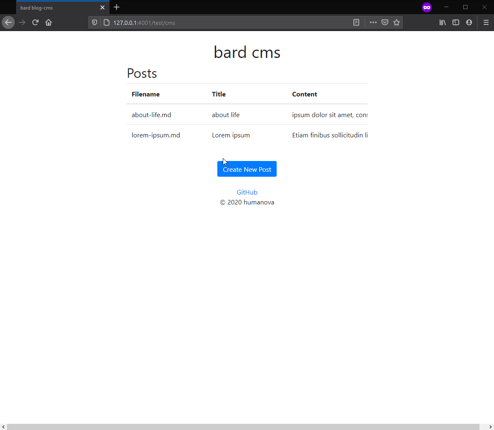

# bard cms

Bard is a simple blog management system to create, update, delete and view *markdown* files.



### */cms* : **GET**
```
reads posts and renders main page
```

### */cms?update_post=filename* : **GET**
```
reads post and renders editor page
```

### */create_post* : **POST**
```
creates a new post with given title and text
```
```json
{
  "title" : "Sample Post",
  "text" : "# Header\nThis is a sample text with *italic* and **bold**."
}
```
### */update_post* : **POST**
```
updates post with new title and text
```
```json
{
  "filename" : "sample-post",
  "title" : "New Title",
  "text" : "New Text"
}
```
### */delete_post* : **POST**
```
deletes post
```
```json
{
  "filename" : "sample-post"
}
```